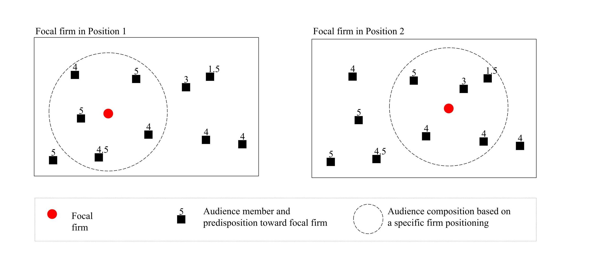
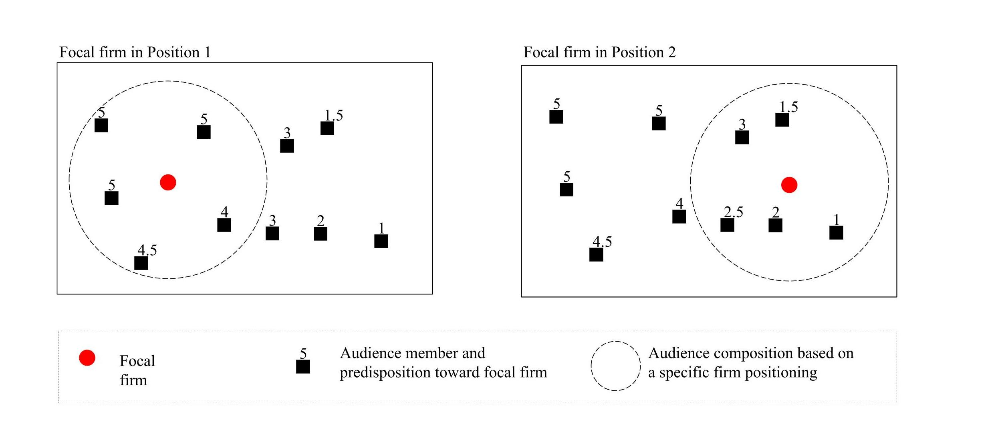
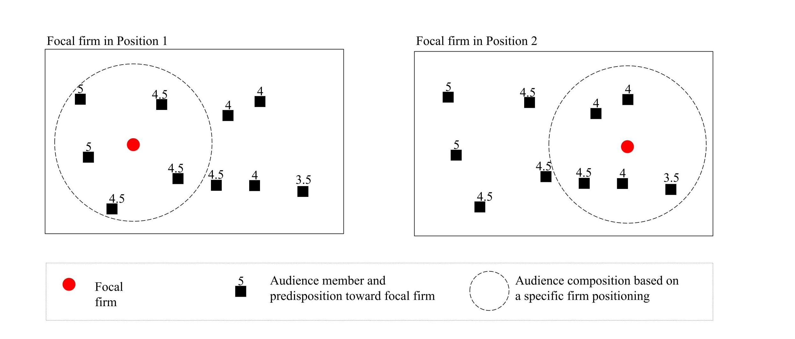
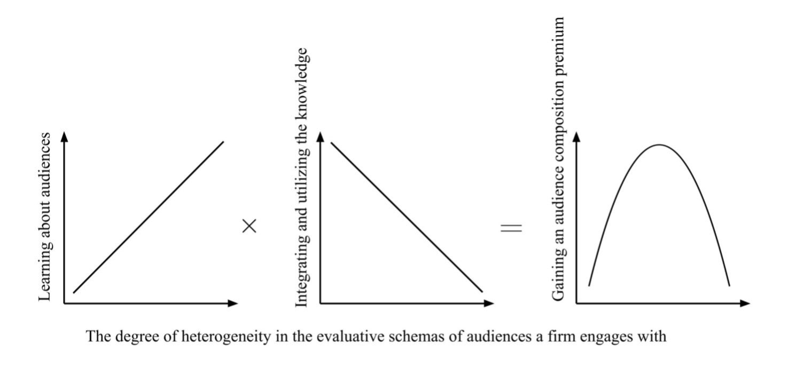
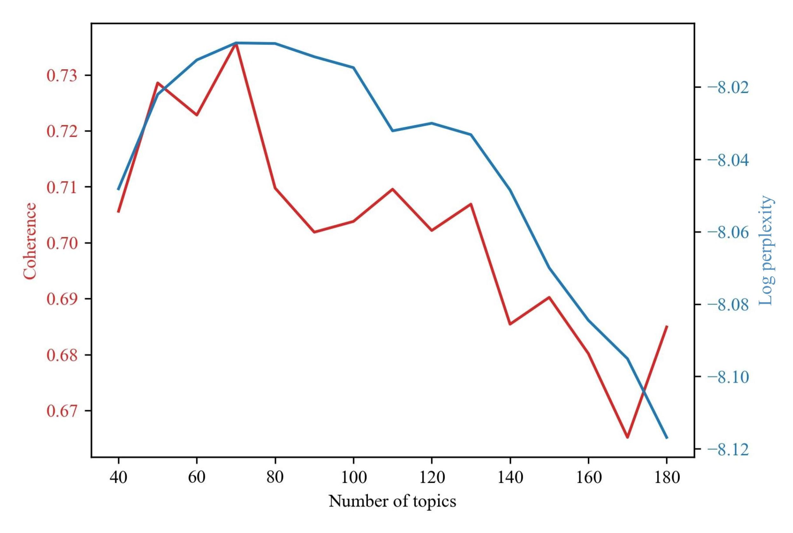
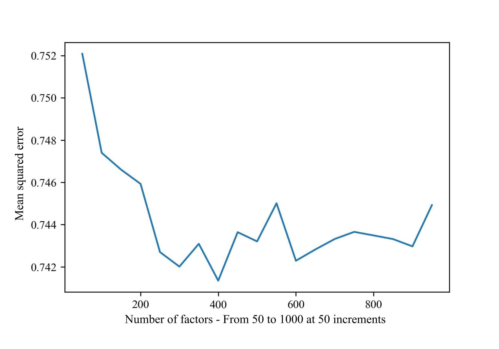
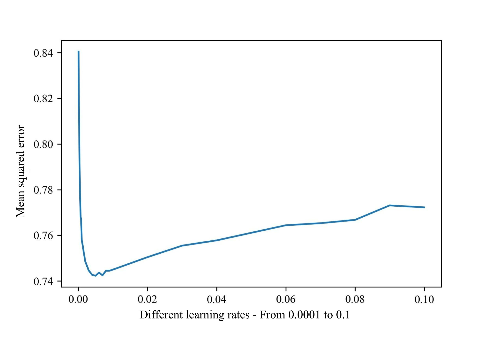
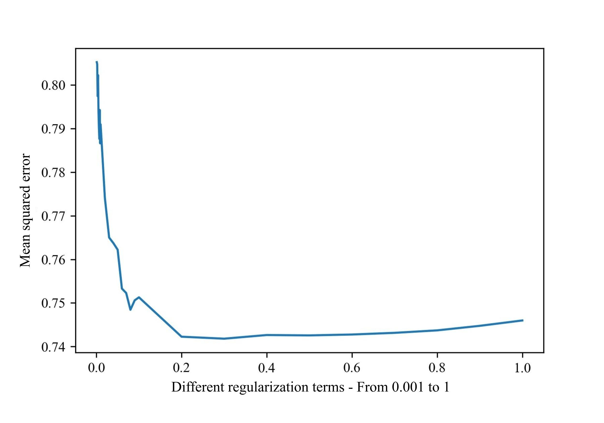
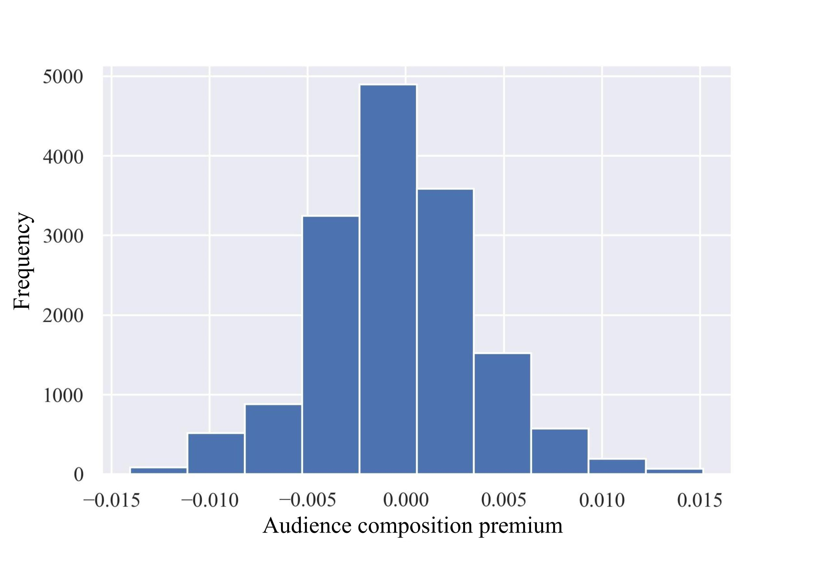

# Table of Contents  
* [Introduction](#introduction)  
* [Citation](#Citation)
* [Theory Summary](#Theorysummary)  
   * [Abstract](#Abstract)
   * [Managerial Summary](#Managerial)
   * [Theoretical Development](#Theoretical)  
      * [Motivation](#Motivation) 
      * [Audience Composition Premium](#Audience) 
      * [Moderating Role of Dispersion in Audience Predispositions](#Moderating) 
      * [Engagement with Audiences Holding Heterogeneous Evaluative Schema](#Engagement) 
* [Empirical Approach](#Empirical)  
   * [Data and Sample](#Data)  
   * [Requirements](#Requirements)  
   * [Topic Modeling on 10-Ks](#Topic)
   * [Training the Funk-SVD Model](#Training)  
   * [Measuring Audience Composition Premium](#Measuring)  
   * [Using Transcripts to Measure the Heterogeneity in the Evaluative Schema of the Audiences Firms Engage With](#Using)

# Introduction 
This repository contains the code used for the empirical analysis of our paper titled “XXX” published at “XXX.” Our study proposes a novel approach to strategic positioning with the aim of garnering higher aggregate evaluations. We train a recommender system using the Funk-SVD algorithm on security analysts’ evaluations of firms, and show that firms can gain higher aggregate evaluations by positioning such that they are more likely to receive attention from analysts with a positive predisposition toward them.

Our aim of publicly sharing the code is to invite future research that could challenge, extend, and build upon our work. For any inquiries regarding the paper and code, please contact the corresponding author of the paper at XXX.

# Citation 
If you use any of the material or insights from this repository, please cite XXXX

# Theory Summary 
## Abstract 
A core question in strategy research is how firms should position themselves to gain favorable audience evaluations. Emphasizing the heterogeneity in audience predispositions, we propose that firms can gain an audience composition premium by strategically positioning themselves to gain more (less) attention from audiences with positive (negative) predispositions toward them. We argue that this approach to strategic positioning is more conducive for firms with high dispersion in their audience predispositions, and firms can increase their ability to gain an audience composition premium by engaging with audiences holding moderately diverse evaluative schemas. We employ recommender systems and topic modeling to analyze 152,312 firm-analyst-year observations from 1997 to 2018 and 297,931 earnings call transcripts of US public firms, and find strong support for our predictions.

## Managerial Summary 
A key question managers encounter is how they can increase the evaluations their firms receive from external evaluators. Of specific importance to managers of public firms is the investment recommendations they receive from security analysts. In this study, we show that firms can increase their aggregate analyst recommendations by influencing the composition of analysts that opt to cover them and gaining evaluation from analysts who have a more favorable predisposition toward them (i.e., by gaining an audience composition premium). Our findings also suggest that such audience composition premium is more important for enhancing a firm’s aggregate analyst recommendation when there is a higher dispersion in analyst predispositions. In this case, to gain an audience composition premium, the firm should engage with analysts that exhibit a moderate degree of diversity in their evaluative schemas.

## Theoretical Development 
### Motivation 
Optimal distinctiveness research suggests that audiences evaluate firms through two stages: first, they screen the pool of products/firms to select a group that is worthy of their attention; second, they sort and evaluate the products/firms within the selected group. Accordingly, research has suggested that firms should conform to categorical bechmarks such as prototypes and exemplars to gain recognition and pass through the first screening step, and only then differentiate from their peers to stand out and succeed in the second stage.

### Audience Composition Premium 
We argue that the two stages of evaluation should be considered inter-dependently, as opposed to sequentially. Firms should position strategically with the aim of passing through the first stage and gaining attention only from those audiences who have a positive predisposition toward them. By doing so, firms gain an audience composition premium, i.e., an increase in the aggregate evaluation they receive that is due to the composition of audiences evaluating them. See Figure 1 from XXX as an example. 
  "As shown, there are a total of 10 evaluators in the environment. Were they all to evaluate the firm, they would give an average rating of 4 to the firm. However, in most contexts, only a select group of audiences evaluate each specific firm. Let us assume in our example that the firm receives evaluations from five out of the 10 evaluators in the environment. Depending on how it positions itself, it could gain an average rating of 4.5 in Position 1 or 3.5 in Position 2. We conceptualize the 0.5 point above the total average rating in Position 1 a premium gained through an optimal composition of audiences evaluating the firm." (p. 10)

|  |
|:--:|
| <b> FIGURE 1 - An illustration of audience composition premium - XXX</b>|

### The Moderating Role of Dispersion in Audience Predispositions 
The audience composition premium that firms can gain is stronger if there is a high dispersion in the predisposition of all audiences in the environment toward them. As shown in Figure 2 below from XXX, the aggregate evaluations that a firm receives is more strongly a function of its audience composition in Panel A, where there is a higher dispersion in audience predispositions, as compared to Panel B, where there is a low dispersion in audience predispositions.

||
|:-----:|
|Panel A – High degree of dispersion in audience predispositions|
|  |
|Panel B – Low degree of dispersion in audience predispositions|
|  |
| <b> FIGURE 2 An illustration of a firm in two different contexts: in Panel A, there is high level of dispersion in audience predispositions whereas in Panel B dispersion in audience predispositions is low. XXX </b>|

### Engagement with Audiences Holding Heterogeneous Evaluative Schema 
To gain an audience composition premium, firms need to learn about their audiences and the evaluative schema that their audiences use for making their evaluations. We propose that firms need to engage with an audience group that holds moderately diverse evaluative schema. While there is a positive relationship between the degree of diversity of evaluative schema that a firm engages with and the firm’s learning about its audiences, the relationship is negative for the firm’s ability to integrate the knowledge and utilize it to position strategically and effectively communicate its positioning to its target audience. Hence, the relationship between the degree of heterogeneity in the evaluative schema of audiences and a firm’s ability to gain an audience composition premium should be an inverted U-shaped relationship, as shown in Figure 3 from XXX.

|  |
|:--:|
| <b> Figure 3 The multiplicative effects of (1) learning about audiences and (2) integrating and utilizing the knowledge gained from engagement with audiences on a firm’s ability to gain an audience composition premium - XXX</b>|

# Empirical Approach 
## Data and Sample 
Multiple sources are used for the empirical analysis in this paper. We use Thomson Reuter’s IBES for security analysts’ investment recommendations, Capital IQ’s Compustat for firms’ financials and accounting data, SEC EDGAR for firms’ 10-K filings, and Capital IQ Transcripts for firms’ earnings calls’ transcripts. We are not able to share the data due to the proprietary nature of these sources.

Below is a list of data input needed to run the code in each file:

1. Topic model 10Ks
   1. **bigram\_transformed\_10ks\_all.txt** A file containing cleaned (lemmatized; stop words, numbers, and punctuations removed; bigram transformed) Item 1 sections of 10-K filings. Each line contains one filing’s data.
   1. **index\_file.pkl** A file mapping each line in the above file to firm identifier and filing date.
1. Composition premium and dispersion in predispositions vars
   1. **recoms\_detail\_1992\_2020.csv** This file is the Recommendations Detail dataset from IBES.
   1. **10ks/lda70\_corpus.csv** This file is a topic model transformation of our corpus constructed in the Topic Model 10Ks file.
1. Audience engagement var
   1. ** speaker detail 1-6.csv** These files contain the questions and answers for all earnings call. Downloaded from Capital IQ Transcripts.
   1. **Trascripts details.csv** This file contains the identifiers for each earnings call. Downloaded from Capital IQ Transcripts.
   1. **predicted\_values\_distances\_lda70\_full.pkl** This file contains the list of companies, and their identifiers, for which we developed the audience composition premium variable.
   1. **identifiers_cusip.csv** This file contains mapping table for company identifiers in the transcripts dataset and firm CUSIP.
1. Regression models
   1. **database\_controls\_all.pkl** This file contains financial and accounting information such as ROE and R&D expenditure from Compustat database.
##
## Requirements 
We recommend using Anaconda’s Spyder environment. Below is a list of libraries that will be needed in addition to Spyder’s standard libraries.

- [Genism](https://pypi.org/project/gensim/)
- [funk_svd](https://github.com/gbolmier/funk-svd)
- [Statsmodels](https://www.statsmodels.org/stable/install.html)
- [pyLDAvis](https://pypi.org/project/pyLDAvis/)

## Topic Modeling on 10-Ks 
Gensim library is used to develop an LDA model on the corpus of 10-K Item 1 sections. Coherence and perplexity scores are used to select the number of topics. As shown in Figure 11 from XXX, the best number of topics for our model is 70.

|  |
|:--:|
| <b> FIGURE 11 Evaluating the topic models on firms’ 10-K filings based on different numbers of topics – XXX </b>|

JS divergence metric is used to measure similarity between two firms' topic weight distribution in their 10-K filing. We use this similarity measures to develop our measure of firm’s positioning relative to analysts’ portfolio of firms under their coverage. We use the following assumption:

where Pr i j is the probability that analyst j will cover firm i, and Similarity i j is the similarity between firm i and analyst j’s coverage portfolio based on firms’ business descriptions.

## Training the Funk-SVD Model 
We use the Funk-SVD algorithm to train a recommender system on analysts’ investment recommendations of public US firms. Our aim is to measure each analyst’s predisposition toward each firm in any given year, regardless of whether they currently or previously have covered and evaluated the firm. We tune our model to choose the best hyperparameters, including the number of factors, learning rate and regularization term. The results are shown in Figures 7-9 in our paper. Based on our tuning, we trained our main model with 400 factors, with a learning rate of 0.005 and a regularization term of 0.2.

|  |
|:--:|
| <b> FIGURE 7 Mean squared error between predicted and actual recommendations for models with different number of factors (from 50 to 1000, at 50 increments) - XXX</b>|

|  |
|:--:|
| <b> FIGURE 8 Mean squared error between predicted and actual recommendations for models with different values of learning rates (from 0.0001 to 0.1) - XXX </b>|

|  |
|:--:|
| <b> FIGURE 9 Mean squared error between predicted and actual recommendations for models with different regularization term values (from 0.001 to 1) - XXX </b>|

## Measuring Audience Composition Premium 
We use the below formula to measure audience composition premium:

where Pri j is the similarity between firm i and analyst j’s portfolio, Ratingi j is the predicted rating of analyst j of firm i, and N is the total number of predicted ratings for firm i.

Figure 12 in our paper shows the distribution of our constructed variable.

|  |
|:--:|
| <b> FIGURE 12 Distribution of the audience composition premium variable - XXX </b>|

## Using Transcripts to Measure the Heterogeneity in the Evaluative Schema of the Audiences Firms Engage With 

We assume that the questions that analysts ask in earnings conference calls are a proxy for the evaluative schema that they use in making their investment recommendations. Since firms engage with only a select number of analysts in the Q&A section of their earnings calls, they are quite selective in which questions to engage with. We measure the heterogeneity in the evaluative schema of the audiences that a firm engages with using the below formula, after implementing a topic model on the corpus of all questions that analysts have asked of all firms in the earnings calls:

Where *N* is the total number of questions asked for firm *I* in a given year, θT, i is the weight of topic *T* in question *i,* and* θT, I* is the average weight of topic T for all questions asked during firm *I*’s earnings calls in the given year.
