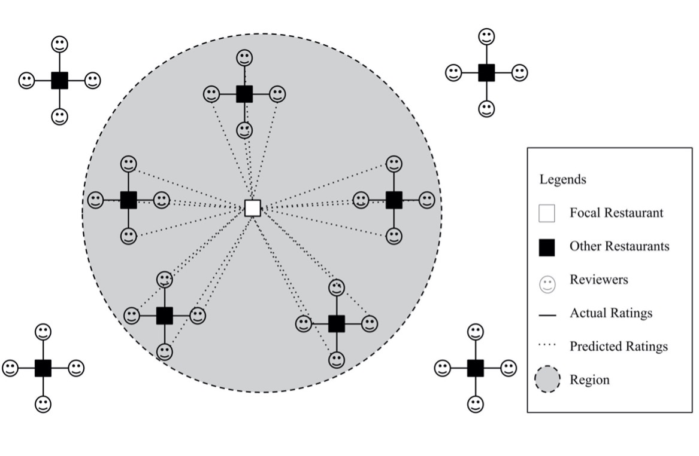
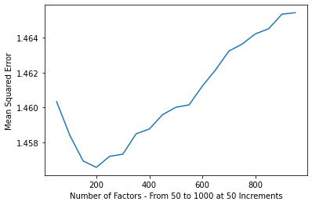

# Audience Composition Premium in Yelp Setting

## Theoretical Development

In this analysis, we develop a model that predicts users’ ratings of restaurants and demonstrate how a restaurant can gain an audience composition premium by positioning in a location where users have a positive predisposition toward it. We used Yelp’s Academic Dataset and limited the observations to businesses in the restaurant and food categories (including restaurants/bars and restaurants/coffee shops). Because we employed a collaborative filtering algorithm that requires data on users’ previous ratings and restaurants’ ratings by other users, we further limited the sample to restaurants that had received at least five ratings and users who had rated at least five restaurants. While it is common to use a higher threshold for dropping observations (sometimes up to 25), there is a small percentage of users in our database who have rated more than 10 restaurants. Therefore, we used a smaller cutoff point. In our final dataset, there are 73,024 unique businesses with a total of 5,174,305 reviews from 334,644 unique users. Individual ratings are on a scale of 1 to 5 with 0.5 increments. Restaurants in the dataset received an average rating of 3.76 from their reviewers.

### Audience Composition Premium through (Geographic) Positioning
Consumers’ attributes and predispositions are regionally heterogeneous (e.g., Govind et al. 2018, Mittal et al. 2004). Thus, the audience composition that a restaurant attracts is largely affected by where it is located. For instance, a restaurant that is situated near a university campus attracts a different audience composition compared to a restaurant located in a suburban residential area where many families have children. Accordingly, a restaurant could gain an audience composition premium if it is located in a place that allows it to attract customers who have a higher predisposition toward it and vice versa. Therefore, a proxy for a restaurant’s audience composition premium can be constructed by taking into account the predispositions of consumers within the geographic region in which it is located.
To determine the audiences a restaurant is more likely to attract in a geographic location, we determined the five (geographically) closest restaurants to the focal restaurant and all the customers who left a rating for any of those five. For the example of a restaurant located in a university district, this sample should mostly consist of students and university staff. Figure 1 below provides a schematic view of how we selected the reviewers of the five closest restaurants to the focal restaurant. Next, we used our trained FunkSVD model to predict the ex ante evaluation of this group of reviewers for a focal restaurant. We also measured the average ratings that a restaurant would gain from all restaurant goers, regardless of its location. By subtracting the average predisposition of all audiences from the regional predisposition of the select group of reviewers in a specific location toward the focal restaurant, we constructed our measure of audience composition premium. 

|  |
|:--:|
| <b> Figure 1 Measuring Regional Predisposition by Predicting the Ratings of Reviewers of the Five Closest Restaurants to a Focal Restaurant</b>|

Higher values of the audience composition premium variable demonstrate that a restaurant would gain higher aggregate ratings because it is positioned to receive attention mostly from audiences with positive predispositions toward it. In a similar vein, if the restaurant is positioned in areas with restaurant-goers that have a negative predisposition toward it, it would receive lower aggregate ratings. Thus, we hypothesize that the audience composition premium is a predictor of restaurants’ aggregate ratings. Due to processing power limitations, we constructed the composition premium varialbe for restaurants in only one example city (Montreal). We used an ordinary least squares (OLS) regression to test our hypothesis while controlling for other covariates. Regression results are shown at the end of the this analysis. We controlled for multiple restaurant attributes available in the Yelp database (e.g., price range, whether the restaurant has wheelchair access, etc.). As shown, the coefficient for the audience composition premium variable is 0.459 with a p-value of 0.021. <br><br>Furthermore, we hypothesize that the effect of audience composition premium is stronger for restaurants with a higher dispersion in the predisposition of audiences toward them. The result from the last table in this analysis shows a positive (90.013) and significant (p-value = 0.002) coefficient for the interaction between audience composition premium and dispersion in audience predispsitions.


## Data and Code

To run this code, download the JSON files from https://www.yelp.com/dataset <br>
Unzip the downloaded file, and put the two following files in the root folder of your open Jupyter Notebook: <br>
<br>
* yelp_academic_dataset_business<br>
* yelp_academic_dataset_review<br>

Import all the needed libraries


```python
import os
import numpy as np
import pandas as pd
import math
from scipy import spatial
import statsmodels.api as sm
from funk_svd import SVD
from sklearn.metrics import mean_absolute_error
from sklearn.metrics import mean_squared_error
from scipy.spatial import distance
import seaborn as sns
import matplotlib.pyplot as plt
from numpy import inf
import pickle
```

## Preparing the databases

Import the needed files
* Note that these files are heavy and this might take a few minutes depending on your system


```python
business = pd.read_json('yelp_academic_dataset_business.json', lines=True)
review = pd.read_json('yelp_academic_dataset_review.json', lines=True)
review.drop(columns=['text'], inplace=True)
```

Keep only one review per user per restaurant (latest review)
Keep only reviewers where the user has at least rated 5 restaurants


```python
review = review.sort_values(['user_id', 'business_id', 'date']).groupby(
        ['user_id', 'business_id']).tail(1)
review['user_rev_count'] = review.groupby(['user_id'])['business_id'].transform('count')
review = review[review['user_rev_count']>4]

```

Keeping only businesses in categories related to food and restaurants


```python
categories = business.categories.value_counts()
categories = list(categories.index)
res_labels = ['Restaurant' ,'Coffee','Food' ,'Drink','Tea','Bar' ]
categories_res = [item for item in categories if any(n in item for n in res_labels)]
business = business[business['categories'].isin(categories_res)]

```

Dropping unnamed businesses


```python
business['name'].replace('', np.nan, inplace=True)
business =  business.dropna(subset=['name'])
```

Creating dummy variables based on restaurants' attributes such as WiFi, Parking, etc.


```python
def create_attributes(df_col):   
    df = pd.concat([df_col, df_col['attributes'].apply(pd.Series)], axis=1)   
    return df

bus_expanded = create_attributes(business[['attributes']])
bus_expanded_drop = bus_expanded.drop(columns=['attributes', 'RestaurantsAttire' ,'NoiseLevel',
                       'BusinessParking', 'BusinessParking','WiFi',
                       'Ambience',	'GoodForMeal', 'BestNights',
                       'Music', 'Smoking',	'DietaryRestrictions',
                       'HairSpecializesIn', 'BYOBCorkage','AgesAllowed'])
bus_expanded_dummy = pd.get_dummies(bus_expanded_drop, drop_first=True)
business = pd.concat([business, bus_expanded_dummy], axis=1)

```

Keeping only businesses with at least 5 ratings


```python
business_review_count = review.groupby(['business_id'])['user_id'].count().reset_index()
business_review_count.columns = ['business_id', 'reviewer_count']
business = pd.merge(business, business_review_count, on=['business_id'],
                    how='inner')
business = business[business['review_count']>4]
```

Measuring mean rating for each business using the reviews data; merging back with the business data


```python
business_review_mean = review.groupby(['business_id'])['stars'].mean().reset_index()
business_review_mean.columns = ['business_id', 'mean_star']
business = pd.merge(business, business_review_mean, on=['business_id'],
                    how='inner')
```

Previewing the two databases that we will work with going forward: business and review


```python
business
```


<div>
<style scoped>
    .dataframe tbody tr th:only-of-type {
        vertical-align: middle;
    }

    .dataframe tbody tr th {
        vertical-align: top;
    }

    .dataframe thead th {
        text-align: right;
    }
</style>
<table border="1" class="dataframe">
  <thead>
    <tr style="text-align: right;">
      <th></th>
      <th>business_id</th>
      <th>name</th>
      <th>address</th>
      <th>city</th>
      <th>state</th>
      <th>postal_code</th>
      <th>latitude</th>
      <th>longitude</th>
      <th>stars</th>
      <th>review_count</th>
      <th>...</th>
      <th>CoatCheck_True</th>
      <th>BusinessAcceptsBitcoin_True</th>
      <th>DriveThru_None</th>
      <th>DriveThru_True</th>
      <th>AcceptsInsurance_None</th>
      <th>AcceptsInsurance_True</th>
      <th>RestaurantsCounterService_True</th>
      <th>Open24Hours_True</th>
      <th>reviewer_count</th>
      <th>mean_star</th>
    </tr>
  </thead>
  <tbody>
    <tr>
      <th>0</th>
      <td>pQeaRpvuhoEqudo3uymHIQ</td>
      <td>The Empanadas House</td>
      <td>404 E Green St</td>
      <td>Champaign</td>
      <td>IL</td>
      <td>61820</td>
      <td>40.110446</td>
      <td>-88.233073</td>
      <td>4.5</td>
      <td>5</td>
      <td>...</td>
      <td>0</td>
      <td>0</td>
      <td>0</td>
      <td>0</td>
      <td>0</td>
      <td>0</td>
      <td>0</td>
      <td>0</td>
      <td>2</td>
      <td>3.500000</td>
    </tr>
    <tr>
      <th>1</th>
      <td>M_guz7Dj7hX0evS672wIwA</td>
      <td>Chocolate Shoppe Ice Cream</td>
      <td>2831 Parmenter St</td>
      <td>Middleton</td>
      <td>WI</td>
      <td>53562</td>
      <td>43.105310</td>
      <td>-89.510142</td>
      <td>3.5</td>
      <td>6</td>
      <td>...</td>
      <td>0</td>
      <td>0</td>
      <td>0</td>
      <td>0</td>
      <td>0</td>
      <td>0</td>
      <td>0</td>
      <td>0</td>
      <td>4</td>
      <td>3.500000</td>
    </tr>
    <tr>
      <th>2</th>
      <td>CsLQLiRoafpJPJSkNX2h5Q</td>
      <td>Middle East Deli</td>
      <td>4508 E Independence Blvd</td>
      <td>Charlotte</td>
      <td>NC</td>
      <td>28205</td>
      <td>35.194894</td>
      <td>-80.767442</td>
      <td>3.0</td>
      <td>5</td>
      <td>...</td>
      <td>0</td>
      <td>0</td>
      <td>0</td>
      <td>0</td>
      <td>0</td>
      <td>0</td>
      <td>0</td>
      <td>0</td>
      <td>5</td>
      <td>3.000000</td>
    </tr>
    <tr>
      <th>3</th>
      <td>lu7vtrp_bE9PnxWfA8g4Pg</td>
      <td>Banzai Sushi</td>
      <td>300 John Street</td>
      <td>Thornhill</td>
      <td>ON</td>
      <td>L3T 5W4</td>
      <td>43.820492</td>
      <td>-79.398466</td>
      <td>4.5</td>
      <td>7</td>
      <td>...</td>
      <td>0</td>
      <td>0</td>
      <td>0</td>
      <td>0</td>
      <td>0</td>
      <td>0</td>
      <td>0</td>
      <td>0</td>
      <td>6</td>
      <td>4.500000</td>
    </tr>
    <tr>
      <th>4</th>
      <td>007Dg4ESDVacWcC4Vq704Q</td>
      <td>Front Door Organics</td>
      <td>415 Horner Avenue</td>
      <td>Toronto</td>
      <td>ON</td>
      <td>M8W 4W3</td>
      <td>43.603232</td>
      <td>-79.538424</td>
      <td>4.0</td>
      <td>8</td>
      <td>...</td>
      <td>0</td>
      <td>0</td>
      <td>0</td>
      <td>0</td>
      <td>0</td>
      <td>0</td>
      <td>0</td>
      <td>0</td>
      <td>7</td>
      <td>4.428571</td>
    </tr>
    <tr>
      <th>...</th>
      <td>...</td>
      <td>...</td>
      <td>...</td>
      <td>...</td>
      <td>...</td>
      <td>...</td>
      <td>...</td>
      <td>...</td>
      <td>...</td>
      <td>...</td>
      <td>...</td>
      <td>...</td>
      <td>...</td>
      <td>...</td>
      <td>...</td>
      <td>...</td>
      <td>...</td>
      <td>...</td>
      <td>...</td>
      <td>...</td>
      <td>...</td>
    </tr>
    <tr>
      <th>73019</th>
      <td>BAVuLTDmpSzDCk37A5HjtQ</td>
      <td>Bruegger's Bagels</td>
      <td>27045 Lorain Rd</td>
      <td>North Olmsted</td>
      <td>OH</td>
      <td>44070</td>
      <td>41.416568</td>
      <td>-81.921396</td>
      <td>3.0</td>
      <td>13</td>
      <td>...</td>
      <td>0</td>
      <td>0</td>
      <td>0</td>
      <td>0</td>
      <td>0</td>
      <td>0</td>
      <td>0</td>
      <td>0</td>
      <td>8</td>
      <td>2.750000</td>
    </tr>
    <tr>
      <th>73020</th>
      <td>hskVqZCPqy-omm9CHi44xQ</td>
      <td>Domino's</td>
      <td>6420 Rea Rd, Suite B1</td>
      <td>Charlotte</td>
      <td>NC</td>
      <td>28226</td>
      <td>35.078538</td>
      <td>-80.818358</td>
      <td>2.0</td>
      <td>16</td>
      <td>...</td>
      <td>0</td>
      <td>0</td>
      <td>0</td>
      <td>0</td>
      <td>0</td>
      <td>0</td>
      <td>0</td>
      <td>0</td>
      <td>10</td>
      <td>1.800000</td>
    </tr>
    <tr>
      <th>73021</th>
      <td>9Q0fPWAjUweoFDk0kafuzQ</td>
      <td>Nishi Sushi</td>
      <td>9750 Weston Road</td>
      <td>Vaughan</td>
      <td>ON</td>
      <td>L4H 2P2</td>
      <td>43.838555</td>
      <td>-79.559823</td>
      <td>4.0</td>
      <td>5</td>
      <td>...</td>
      <td>0</td>
      <td>0</td>
      <td>0</td>
      <td>0</td>
      <td>0</td>
      <td>0</td>
      <td>0</td>
      <td>0</td>
      <td>4</td>
      <td>4.000000</td>
    </tr>
    <tr>
      <th>73022</th>
      <td>PotiAhtDMYMNsJCzV0oLAw</td>
      <td>Walmart</td>
      <td>3240 Wilkinson Blvd</td>
      <td>Charlotte</td>
      <td>NC</td>
      <td>28208</td>
      <td>35.226307</td>
      <td>-80.893539</td>
      <td>2.0</td>
      <td>13</td>
      <td>...</td>
      <td>0</td>
      <td>0</td>
      <td>0</td>
      <td>0</td>
      <td>0</td>
      <td>0</td>
      <td>0</td>
      <td>0</td>
      <td>12</td>
      <td>1.916667</td>
    </tr>
    <tr>
      <th>73023</th>
      <td>SYa2j1boLF8DcGVOYfHPcA</td>
      <td>Five Guys</td>
      <td>7014-590 E Camelback Rd</td>
      <td>Scottsdale</td>
      <td>AZ</td>
      <td>85251</td>
      <td>33.504062</td>
      <td>-111.929431</td>
      <td>3.5</td>
      <td>97</td>
      <td>...</td>
      <td>0</td>
      <td>0</td>
      <td>0</td>
      <td>0</td>
      <td>0</td>
      <td>0</td>
      <td>0</td>
      <td>0</td>
      <td>83</td>
      <td>3.337349</td>
    </tr>
  </tbody>
</table>
<p>73024 rows × 71 columns</p>
</div>


```python
review
```


<div>
<style scoped>
    .dataframe tbody tr th:only-of-type {
        vertical-align: middle;
    }

    .dataframe tbody tr th {
        vertical-align: top;
    }

    .dataframe thead th {
        text-align: right;
    }
</style>
<table border="1" class="dataframe">
  <thead>
    <tr style="text-align: right;">
      <th></th>
      <th>review_id</th>
      <th>user_id</th>
      <th>business_id</th>
      <th>stars</th>
      <th>useful</th>
      <th>funny</th>
      <th>cool</th>
      <th>date</th>
      <th>user_rev_count</th>
    </tr>
  </thead>
  <tbody>
    <tr>
      <th>5391866</th>
      <td>v8QPs6AaixrqXvC5rHqUrQ</td>
      <td>---1lKK3aKOuomHnwAkAow</td>
      <td>--9e1ONYQuAa-CB_Rrw7Tw</td>
      <td>4</td>
      <td>0</td>
      <td>0</td>
      <td>0</td>
      <td>2008-11-11 04:40:05</td>
      <td>126</td>
    </tr>
    <tr>
      <th>6073363</th>
      <td>FlRoZ1T8QmS4gs3F463FJQ</td>
      <td>---1lKK3aKOuomHnwAkAow</td>
      <td>-ErwgUmZ1-jHW_rSu55jlg</td>
      <td>5</td>
      <td>2</td>
      <td>0</td>
      <td>0</td>
      <td>2010-11-09 20:21:52</td>
      <td>126</td>
    </tr>
    <tr>
      <th>4776904</th>
      <td>Q8ax2kiz4SUJIKxOeLNwMg</td>
      <td>---1lKK3aKOuomHnwAkAow</td>
      <td>0YhT9HCBkU394IG6tQVtNQ</td>
      <td>1</td>
      <td>13</td>
      <td>4</td>
      <td>3</td>
      <td>2012-05-01 16:17:54</td>
      <td>126</td>
    </tr>
    <tr>
      <th>842496</th>
      <td>5ZLVbvlGiyoW9FzDFC1Esg</td>
      <td>---1lKK3aKOuomHnwAkAow</td>
      <td>1JgaRBX0oiRsvEhHF3ZMjw</td>
      <td>1</td>
      <td>5</td>
      <td>7</td>
      <td>1</td>
      <td>2011-02-16 03:58:48</td>
      <td>126</td>
    </tr>
    <tr>
      <th>5643977</th>
      <td>Qd3uO4b77vkEo-djm76dzQ</td>
      <td>---1lKK3aKOuomHnwAkAow</td>
      <td>1Vn_lex3LGGwuTo-xeJnww</td>
      <td>5</td>
      <td>0</td>
      <td>0</td>
      <td>0</td>
      <td>2011-02-16 04:16:12</td>
      <td>126</td>
    </tr>
    <tr>
      <th>...</th>
      <td>...</td>
      <td>...</td>
      <td>...</td>
      <td>...</td>
      <td>...</td>
      <td>...</td>
      <td>...</td>
      <td>...</td>
      <td>...</td>
    </tr>
    <tr>
      <th>1872462</th>
      <td>AjLndo5huuoPsz9AWkJ6Jw</td>
      <td>zzxZoMmjbUjXcWZzrE3PIw</td>
      <td>VYNriOotbFZ7Qj_6jwUB5g</td>
      <td>2</td>
      <td>2</td>
      <td>0</td>
      <td>0</td>
      <td>2013-11-07 07:04:17</td>
      <td>6</td>
    </tr>
    <tr>
      <th>4826632</th>
      <td>Y-xyvD7TmXjyV-D6sxHOTw</td>
      <td>zzxZoMmjbUjXcWZzrE3PIw</td>
      <td>YNHvFEvp9VDNwX5VhRanYQ</td>
      <td>3</td>
      <td>0</td>
      <td>0</td>
      <td>0</td>
      <td>2015-11-06 03:38:39</td>
      <td>6</td>
    </tr>
    <tr>
      <th>6741590</th>
      <td>SDalKhkRTXH3dVnbd8RSbA</td>
      <td>zzxZoMmjbUjXcWZzrE3PIw</td>
      <td>fe1-frEQYkHlknn3RrcP8g</td>
      <td>1</td>
      <td>0</td>
      <td>0</td>
      <td>0</td>
      <td>2015-01-15 16:10:17</td>
      <td>6</td>
    </tr>
    <tr>
      <th>2078715</th>
      <td>tTrtMgLmp2REgIG3Pouxdw</td>
      <td>zzxZoMmjbUjXcWZzrE3PIw</td>
      <td>g6l78EOVGYzMmnTSGj8TcA</td>
      <td>1</td>
      <td>0</td>
      <td>0</td>
      <td>0</td>
      <td>2017-09-29 23:14:29</td>
      <td>6</td>
    </tr>
    <tr>
      <th>2169316</th>
      <td>VE0_zE-eKvcpMrfa_1wDhw</td>
      <td>zzxZoMmjbUjXcWZzrE3PIw</td>
      <td>sqNt7jduSQh1Q7xY-r_biw</td>
      <td>1</td>
      <td>2</td>
      <td>0</td>
      <td>0</td>
      <td>2014-02-25 11:52:07</td>
      <td>6</td>
    </tr>
  </tbody>
</table>
<p>5174305 rows × 9 columns</p>
</div>


```python
print(review['user_id'].nunique())
print(review['stars'].mean())
```

    334644
    3.7625482069572627


## Training a Funk-SVD Model

We will use the 'review' dataset to train the model
We first need to set the column names to 'u_id', 'i_id', 'rating' for the Funk-SVD model


```python
review_select = review[['user_id', 'business_id', 'stars']]
review_select.columns = ['u_id', 'i_id', 'rating']
```


```python
review_select
```


<div>
<style scoped>
    .dataframe tbody tr th:only-of-type {
        vertical-align: middle;
    }

    .dataframe tbody tr th {
        vertical-align: top;
    }

    .dataframe thead th {
        text-align: right;
    }
</style>
<table border="1" class="dataframe">
  <thead>
    <tr style="text-align: right;">
      <th></th>
      <th>u_id</th>
      <th>i_id</th>
      <th>rating</th>
    </tr>
  </thead>
  <tbody>
    <tr>
      <th>5391866</th>
      <td>---1lKK3aKOuomHnwAkAow</td>
      <td>--9e1ONYQuAa-CB_Rrw7Tw</td>
      <td>4</td>
    </tr>
    <tr>
      <th>6073363</th>
      <td>---1lKK3aKOuomHnwAkAow</td>
      <td>-ErwgUmZ1-jHW_rSu55jlg</td>
      <td>5</td>
    </tr>
    <tr>
      <th>4776904</th>
      <td>---1lKK3aKOuomHnwAkAow</td>
      <td>0YhT9HCBkU394IG6tQVtNQ</td>
      <td>1</td>
    </tr>
    <tr>
      <th>842496</th>
      <td>---1lKK3aKOuomHnwAkAow</td>
      <td>1JgaRBX0oiRsvEhHF3ZMjw</td>
      <td>1</td>
    </tr>
    <tr>
      <th>5643977</th>
      <td>---1lKK3aKOuomHnwAkAow</td>
      <td>1Vn_lex3LGGwuTo-xeJnww</td>
      <td>5</td>
    </tr>
    <tr>
      <th>...</th>
      <td>...</td>
      <td>...</td>
      <td>...</td>
    </tr>
    <tr>
      <th>1872462</th>
      <td>zzxZoMmjbUjXcWZzrE3PIw</td>
      <td>VYNriOotbFZ7Qj_6jwUB5g</td>
      <td>2</td>
    </tr>
    <tr>
      <th>4826632</th>
      <td>zzxZoMmjbUjXcWZzrE3PIw</td>
      <td>YNHvFEvp9VDNwX5VhRanYQ</td>
      <td>3</td>
    </tr>
    <tr>
      <th>6741590</th>
      <td>zzxZoMmjbUjXcWZzrE3PIw</td>
      <td>fe1-frEQYkHlknn3RrcP8g</td>
      <td>1</td>
    </tr>
    <tr>
      <th>2078715</th>
      <td>zzxZoMmjbUjXcWZzrE3PIw</td>
      <td>g6l78EOVGYzMmnTSGj8TcA</td>
      <td>1</td>
    </tr>
    <tr>
      <th>2169316</th>
      <td>zzxZoMmjbUjXcWZzrE3PIw</td>
      <td>sqNt7jduSQh1Q7xY-r_biw</td>
      <td>1</td>
    </tr>
  </tbody>
</table>
<p>5174305 rows × 3 columns</p>
</div>


Now we split the sample into training, validation, and test sets


```python
train = review_select.sample(frac=0.8, random_state=7)
val = review_select.drop(train.index.tolist()).sample(frac=0.5, random_state=8)
test = review_select.drop(train.index.tolist()).drop(val.index.tolist())

```

### Tuning the Model

Finding an optimal number of factors for the funk-svd model


```python
mae_list = []
mse_list = []
n_factors = []
```


```python
for i in range(50, 1000, 50):
    svd = SVD(lr= 0.005, reg=0.2, n_epochs=100, early_stopping=False,
          n_factors=i, min_rating=1, max_rating=5, shuffle=True)
    svd.fit(X=train)
    pred = svd.predict(val)
    mse = mean_squared_error(val['rating'], pred)
    mse_list.append(mse)
    mae = mean_absolute_error(val['rating'], pred)
    mae_list.append(mae)
    n_factors.append(i)
    print(f'Test MAE: {mae:.2f}')
```

    Preprocessing data...

    Epoch 1/100  | took 1.8 sec
    Epoch 2/100  | took 1.7 sec
    Epoch 3/100  | took 1.8 sec
    Epoch 4/100  | took 1.7 sec
    Epoch 5/100  | took 1.8 sec
    Epoch 6/100  | took 1.8 sec

    .....
    Epoch 78/100 | took 2.8 sec
    Epoch 79/100 | took 2.8 sec
    Epoch 80/100 | took 2.8 sec
    Epoch 81/100 | took 2.8 sec
    Epoch 82/100 | took 2.8 sec
    Epoch 83/100 | took 2.8 sec
    Epoch 84/100 | took 2.8 sec
    Epoch 85/100 | took 2.8 sec
    Epoch 86/100 | took 2.8 sec
    Epoch 87/100 | took 2.8 sec
    Epoch 88/100 | took 2.8 sec
    Epoch 89/100 | took 2.8 sec
    Epoch 90/100 | took 2.8 sec
    Epoch 91/100 | took 2.9 sec
    Epoch 92/100 | took 2.9 sec
    Epoch 93/100 | took 2.8 sec
    Epoch 94/100 | took 2.8 sec
    Epoch 95/100 | took 2.9 sec
    Epoch 96/100 | took 2.8 sec
    Epoch 97/100 | took 2.8 sec
    Epoch 98/100 | took 2.8 sec
    Epoch 99/100 | took 2.8 sec
    Epoch 100/100 | took 2.8 sec

    Training took 4 min and 59 sec

    ....
    Epoch 91/100 | took 7.6 sec
    Epoch 92/100 | took 7.6 sec
    Epoch 93/100 | took 7.9 sec
    Epoch 94/100 | took 7.7 sec
    Epoch 95/100 | took 7.7 sec
    Epoch 96/100 | took 7.8 sec
    Epoch 97/100 | took 7.7 sec
    Epoch 98/100 | took 7.7 sec
    Epoch 99/100 | took 7.7 sec
    Epoch 100/100 | took 7.7 sec

    Training took 13 min and 7 sec
    Test MAE: 0.96

```python
plt.plot(n_factors, mse_list)
plt.xlabel('Number of Factors - From 50 to 1000 at 50 Increments')
plt.ylabel('Mean Squared Error')

```


    Text(0, 0.5, 'Mean Squared Error')





Based on the test above, we select the nubmer of factors to be 200

### Training the Main Model


```python
svd = SVD(lr= 0.005, reg=0.2, n_epochs=100, early_stopping=False,
          n_factors=200, min_rating=1, max_rating=5, shuffle=True)

svd.fit(X=train)
```

    Preprocessing data...

    Epoch 1/100  | took 2.8 sec
    Epoch 2/100  | took 2.8 sec
    Epoch 3/100  | took 2.8 sec
    Epoch 4/100  | took 2.8 sec
    Epoch 5/100  | took 2.9 sec
    ....
    Epoch 95/100 | took 2.9 sec
    Epoch 96/100 | took 2.8 sec
    Epoch 97/100 | took 2.8 sec
    Epoch 98/100 | took 2.8 sec
    Epoch 99/100 | took 2.8 sec
    Epoch 100/100 | took 2.8 sec

    Training took 4 min and 59 sec


We use our test sample to run a test on the accuracy of our model's predictions


```python
pred = svd.predict(test)

X = pred
y = test["rating"]

X2 = sm.add_constant(X)
est = sm.OLS(y, X2)
est2 = est.fit()
print(est2.summary())
```

                                OLS Regression Results                            
    ==============================================================================
    Dep. Variable:                 rating   R-squared:                       0.239
    Model:                            OLS   Adj. R-squared:                  0.239
    Method:                 Least Squares   F-statistic:                 1.625e+05
    Date:                Wed, 06 Jul 2022   Prob (F-statistic):               0.00
    Time:                        14:49:03   Log-Likelihood:            -8.2974e+05
    No. Observations:              517431   AIC:                         1.659e+06
    Df Residuals:                  517429   BIC:                         1.660e+06
    Df Model:                           1                                         
    Covariance Type:            nonrobust                                         
    ==============================================================================
                     coef    std err          t      P>|t|      [0.025      0.975]
    ------------------------------------------------------------------------------
    const         -0.2696      0.010    -26.576      0.000      -0.290      -0.250
    x1             1.0679      0.003    403.073      0.000       1.063       1.073
    ==============================================================================
    Omnibus:                    31932.729   Durbin-Watson:                   1.953
    Prob(Omnibus):                  0.000   Jarque-Bera (JB):            38199.843
    Skew:                          -0.662   Prob(JB):                         0.00
    Kurtosis:                       3.140   Cond. No.                         24.8
    ==============================================================================

    Notes:
    [1] Standard Errors assume that the covariance matrix of the errors is correctly specified.


## FIND NEAREST NEIGHBORS AND BUILD REGIONAL PREDISPOSITION


```python
def cartesian(latitude, longitude, elevation = 0):
    # Convert to radians
    latitude = latitude * (math.pi / 180)
    longitude = longitude * (math.pi / 180)

    R = 6371 # 6378137.0 + elevation  # relative to centre of the earth
    X = R * math.cos(latitude) * math.cos(longitude)
    Y = R * math.cos(latitude) * math.sin(longitude)
    Z = R * math.sin(latitude)
    return (X, Y, Z)

places = []
for index, row in business.iterrows():
    coordinates = [row['latitude'], row['longitude']]
    cartesian_coord = cartesian(*coordinates)
    places.append(cartesian_coord)

tree = spatial.KDTree(places)

def find_population(lat, lon, n):
    print(n)
    cartesian_coord = cartesian(lat, lon)
    closest = tree.query([cartesian_coord],6 ,  p = 2)
    index = list(closest[1][0])
    del index[0]
    return_dict = {
        'business_id'  :business.business_id.iloc[index],
        'distance' : closest[0][0][1:]
    }
    return return_dict
```

Running a simple test to find the 5 nearest restaurants for a specific latitude and longitude coordinates


```python
test = find_population( 33.479139, -112.221142, 5)
print(test)
```

    5
    {'business_id': 72204    QkG3KUXwqZBW18A9k1xqCA
    2473     e4iYJVyoUAKlitSnxjgwbg
    34572    ySkrz264l39YRcZ2-48C1g
    18392    ut6eoEAaE7WsdLFj9zueLw
    4477     U6eg7zI-0TosgVvmrOtlZg
    Name: business_id, dtype: object, 'distance': array([0.04342269, 0.12556369, 0.13521601, 0.1438866 , 0.14698063])}


We find the 5 nearest neighbors for all our businesses


```python
business_5nearest = business.apply(lambda x: find_population(
        x['latitude'], x['longitude'], x.name),
                   axis=1)
business_5nearest = business_5nearest.reset_index(name='res')

business_5nearest = pd.concat([business_5nearest.drop(['res'], axis=1)
    , business_5nearest['res'].apply(pd.Series)], axis=1)
business_5nearest.rename(columns={ "business_id": "business_id_allFirms" }, inplace = True)
business_5nearest['business_id'] = (business['business_id'].values)

reviewers_indexed = review.set_index('business_id')
def using_repeat(df):
    lens = [len(item) for item in df['business_id_allFirms']]
    return pd.DataFrame( {"firm1" : np.repeat(df['business_id'].values,lens),
                          "firm2" : np.concatenate(df['business_id_allFirms'].values),
                          "dist" : np.concatenate(df['distance'].values)})
business_5nearest_ex = using_repeat(business_5nearest)

business_5nearest_ex = business_5nearest_ex[
        business_5nearest_ex['dist']<=1]    
business_5nearest_ex_reviewers = pd.merge(
        business_5nearest_ex, reviewers_indexed[['user_id']],
        right_index=True, left_on='firm2', how='inner')

business_5nearest_ex_reviewers = business_5nearest_ex_reviewers.groupby(
        ['firm1','user_id']).head(1).reset_index()[['firm1','user_id']]
business_5nearest_ex_reviewers = business_5nearest_ex_reviewers[['user_id','firm1']]
business_5nearest_ex_reviewers.columns = ['u_id','i_id']

business_5nearest_ex_reviewers_pred = (svd.predict(
        business_5nearest_ex_reviewers))
business_5nearest_ex_reviewers['pred'] = business_5nearest_ex_reviewers_pred

business_neighbor_predictions = (
    business_5nearest_ex_reviewers.groupby(['i_id'])['pred'].mean().reset_index())
```

    0
    1
    2
    3
    4
    5
    6
    7
    8
    9
    10
    11
    12
    13
    14
    15
    ....
    73018
    73019
    73020
    73021
    73022
    73023

### Average rating prediction for all Yelp users, regardless of the region/location
### Please note: we limit our sample to restaurants in one city (Montréal), otherwise this block of code can take about a week to run on an average laptop


```python
business_montreal = business[business['city'] == 'Montréal']
```


```python
reviewers_montreal = pd.merge(review, business_montreal, on ='business_id',
                             how='inner')
reviewers_montreal = reviewers_montreal['user_id'].unique()
reviewers_montreal = pd.DataFrame(reviewers_montreal, columns=['u_id'])

```


```python
mean_ratings_montreal = {}
i = 1
for index, row in business_montreal.iterrows():
    print(i)
    i+=1
    business_id = row['business_id']
    business_all_reviewers = reviewers_montreal.assign(i_id=business_id)
    preds_all = svd.predict(business_all_reviewers)
    preds_all_np = np.array(preds_all)
    preds_all_mean = preds_all_np.mean()
    preds_all_std = preds_all_np.std()
    mean_ratings_montreal[business_id] = [preds_all_mean, preds_all_std]
    

mean_ratings_montreal = pd.DataFrame.from_dict(mean_ratings_montreal,orient='index')
mean_ratings_montreal.reset_index(inplace=True)
mean_ratings_montreal.columns = ['i_id','mean_preds', 'std_preds']
mean_ratings_montreal.to_pickle('mean_ratings_phoenix.pkl')
```

    1
    2
    3
    4
    5
    6
    7
    8
    9
    ....
    4044
    4045
    4046
    4047
    4048
    4049
    4050
    4051


```python
mean_ratings_montreal
```


<div>
<style scoped>
    .dataframe tbody tr th:only-of-type {
        vertical-align: middle;
    }

    .dataframe tbody tr th {
        vertical-align: top;
    }

    .dataframe thead th {
        text-align: right;
    }
</style>
<table border="1" class="dataframe">
  <thead>
    <tr style="text-align: right;">
      <th></th>
      <th>i_id</th>
      <th>mean_preds</th>
      <th>std_preds</th>
    </tr>
  </thead>
  <tbody>
    <tr>
      <th>0</th>
      <td>LoRef3ChgZKbxUio-sHgQg</td>
      <td>3.168962</td>
      <td>0.403354</td>
    </tr>
    <tr>
      <th>1</th>
      <td>6GHwgKNlvfIMUpFaxgBjUA</td>
      <td>3.360401</td>
      <td>0.404383</td>
    </tr>
    <tr>
      <th>2</th>
      <td>Ir_QIzs-4o9ElOtiGuxJrw</td>
      <td>4.179629</td>
      <td>0.395448</td>
    </tr>
    <tr>
      <th>3</th>
      <td>UFU8ONTkzEkcOk61XJ8JwQ</td>
      <td>3.725871</td>
      <td>0.403348</td>
    </tr>
    <tr>
      <th>4</th>
      <td>t749-3jKKDyO8QH3VezUHA</td>
      <td>3.497158</td>
      <td>0.398755</td>
    </tr>
    <tr>
      <th>...</th>
      <td>...</td>
      <td>...</td>
      <td>...</td>
    </tr>
    <tr>
      <th>4046</th>
      <td>iWWzRAnDWrg1YImwTCVcWQ</td>
      <td>4.289496</td>
      <td>0.391563</td>
    </tr>
    <tr>
      <th>4047</th>
      <td>MpvKVWQYDpbiQ1RA3bzXsg</td>
      <td>3.451007</td>
      <td>0.401928</td>
    </tr>
    <tr>
      <th>4048</th>
      <td>IxthHWpZgpdt72uOUWPgaQ</td>
      <td>4.539588</td>
      <td>0.371419</td>
    </tr>
    <tr>
      <th>4049</th>
      <td>_rZyr1lrIoBaz65XiDPP6A</td>
      <td>3.881188</td>
      <td>0.398148</td>
    </tr>
    <tr>
      <th>4050</th>
      <td>ZM-BSBJRa5Wv8iYtLpEcww</td>
      <td>2.980705</td>
      <td>0.403270</td>
    </tr>
  </tbody>
</table>
<p>4051 rows × 3 columns</p>
</div>


## Constructing the Audience Composition Premium Variable


```python
comp_prem_mont = pd.merge(business_neighbor_predictions, mean_ratings_montreal, 
                         on=['i_id'], how='inner')
comp_prem_mont['comp_prem'] = comp_prem_mont['pred'] - comp_prem_mont['mean_preds']

```

## Testing the Audience Composition Premium Variable 


```python
business_mont = pd.merge(business, comp_prem_mont, left_on=['business_id'], 
                        right_on=['i_id'], how='inner')
business_mont
```


<div>
<style scoped>
    .dataframe tbody tr th:only-of-type {
        vertical-align: middle;
    }

    .dataframe tbody tr th {
        vertical-align: top;
    }

    .dataframe thead th {
        text-align: right;
    }
</style>
<table border="1" class="dataframe">
  <thead>
    <tr style="text-align: right;">
      <th></th>
      <th>business_id</th>
      <th>name</th>
      <th>address</th>
      <th>city</th>
      <th>state</th>
      <th>postal_code</th>
      <th>latitude</th>
      <th>longitude</th>
      <th>stars</th>
      <th>review_count</th>
      <th>...</th>
      <th>AcceptsInsurance_True</th>
      <th>RestaurantsCounterService_True</th>
      <th>Open24Hours_True</th>
      <th>reviewer_count</th>
      <th>mean_star</th>
      <th>i_id</th>
      <th>pred</th>
      <th>mean_preds</th>
      <th>std_preds</th>
      <th>comp_prem</th>
    </tr>
  </thead>
  <tbody>
    <tr>
      <th>0</th>
      <td>LoRef3ChgZKbxUio-sHgQg</td>
      <td>Amir</td>
      <td>5252 Rue Jean Talon O</td>
      <td>Montréal</td>
      <td>QC</td>
      <td>H4P 2A7</td>
      <td>45.494870</td>
      <td>-73.651904</td>
      <td>3.0</td>
      <td>18</td>
      <td>...</td>
      <td>0</td>
      <td>0</td>
      <td>0</td>
      <td>12</td>
      <td>3.083333</td>
      <td>LoRef3ChgZKbxUio-sHgQg</td>
      <td>3.074375</td>
      <td>3.168962</td>
      <td>0.403354</td>
      <td>-0.094587</td>
    </tr>
    <tr>
      <th>1</th>
      <td>6GHwgKNlvfIMUpFaxgBjUA</td>
      <td>L'Artisan Piadineria</td>
      <td>3421 Rue Saint-Denis</td>
      <td>Montréal</td>
      <td>QC</td>
      <td>H2L 3L2</td>
      <td>45.517369</td>
      <td>-73.567940</td>
      <td>4.0</td>
      <td>9</td>
      <td>...</td>
      <td>0</td>
      <td>0</td>
      <td>0</td>
      <td>7</td>
      <td>3.571429</td>
      <td>6GHwgKNlvfIMUpFaxgBjUA</td>
      <td>3.388941</td>
      <td>3.360401</td>
      <td>0.404383</td>
      <td>0.028540</td>
    </tr>
    <tr>
      <th>2</th>
      <td>Ir_QIzs-4o9ElOtiGuxJrw</td>
      <td>Torteria Lupita</td>
      <td>4601 Rue Notre-Dame O</td>
      <td>Montréal</td>
      <td>QC</td>
      <td>H4C 1S5</td>
      <td>45.473632</td>
      <td>-73.588135</td>
      <td>4.0</td>
      <td>19</td>
      <td>...</td>
      <td>0</td>
      <td>0</td>
      <td>0</td>
      <td>14</td>
      <td>3.928571</td>
      <td>Ir_QIzs-4o9ElOtiGuxJrw</td>
      <td>4.122734</td>
      <td>4.179629</td>
      <td>0.395448</td>
      <td>-0.056895</td>
    </tr>
    <tr>
      <th>3</th>
      <td>UFU8ONTkzEkcOk61XJ8JwQ</td>
      <td>Nickels</td>
      <td>1200 Rue Peel</td>
      <td>Montréal</td>
      <td>QC</td>
      <td>H3B 2T6</td>
      <td>45.499435</td>
      <td>-73.572117</td>
      <td>2.0</td>
      <td>5</td>
      <td>...</td>
      <td>0</td>
      <td>0</td>
      <td>0</td>
      <td>4</td>
      <td>2.500000</td>
      <td>UFU8ONTkzEkcOk61XJ8JwQ</td>
      <td>3.737128</td>
      <td>3.725871</td>
      <td>0.403348</td>
      <td>0.011257</td>
    </tr>
    <tr>
      <th>4</th>
      <td>t749-3jKKDyO8QH3VezUHA</td>
      <td>Chao Phraya</td>
      <td>50 Avenue Laurier O</td>
      <td>Montréal</td>
      <td>QC</td>
      <td>H2T 2N4</td>
      <td>45.522376</td>
      <td>-73.593123</td>
      <td>3.5</td>
      <td>48</td>
      <td>...</td>
      <td>0</td>
      <td>0</td>
      <td>0</td>
      <td>39</td>
      <td>3.615385</td>
      <td>t749-3jKKDyO8QH3VezUHA</td>
      <td>3.513927</td>
      <td>3.497158</td>
      <td>0.398755</td>
      <td>0.016769</td>
    </tr>
    <tr>
      <th>...</th>
      <td>...</td>
      <td>...</td>
      <td>...</td>
      <td>...</td>
      <td>...</td>
      <td>...</td>
      <td>...</td>
      <td>...</td>
      <td>...</td>
      <td>...</td>
      <td>...</td>
      <td>...</td>
      <td>...</td>
      <td>...</td>
      <td>...</td>
      <td>...</td>
      <td>...</td>
      <td>...</td>
      <td>...</td>
      <td>...</td>
      <td>...</td>
    </tr>
    <tr>
      <th>4039</th>
      <td>iWWzRAnDWrg1YImwTCVcWQ</td>
      <td>Brioche à Tête</td>
      <td>107 Avenue Fairmount O</td>
      <td>Montréal</td>
      <td>QC</td>
      <td>H2T 2M4</td>
      <td>45.522518</td>
      <td>-73.595973</td>
      <td>4.5</td>
      <td>25</td>
      <td>...</td>
      <td>0</td>
      <td>0</td>
      <td>0</td>
      <td>20</td>
      <td>4.500000</td>
      <td>iWWzRAnDWrg1YImwTCVcWQ</td>
      <td>4.331850</td>
      <td>4.289496</td>
      <td>0.391563</td>
      <td>0.042354</td>
    </tr>
    <tr>
      <th>4040</th>
      <td>MpvKVWQYDpbiQ1RA3bzXsg</td>
      <td>Thaï Express</td>
      <td>1504 Rue de Bleury</td>
      <td>Montréal</td>
      <td>QC</td>
      <td>H3A 2J2</td>
      <td>45.506903</td>
      <td>-73.568493</td>
      <td>3.0</td>
      <td>9</td>
      <td>...</td>
      <td>0</td>
      <td>0</td>
      <td>0</td>
      <td>3</td>
      <td>3.666667</td>
      <td>MpvKVWQYDpbiQ1RA3bzXsg</td>
      <td>3.462501</td>
      <td>3.451007</td>
      <td>0.401928</td>
      <td>0.011494</td>
    </tr>
    <tr>
      <th>4041</th>
      <td>IxthHWpZgpdt72uOUWPgaQ</td>
      <td>La Fromagerie Hamel</td>
      <td>2117 Avenue Mont-Royal Est</td>
      <td>Montréal</td>
      <td>QC</td>
      <td>H2H 1J9</td>
      <td>45.535421</td>
      <td>-73.572226</td>
      <td>5.0</td>
      <td>9</td>
      <td>...</td>
      <td>0</td>
      <td>0</td>
      <td>0</td>
      <td>5</td>
      <td>5.000000</td>
      <td>IxthHWpZgpdt72uOUWPgaQ</td>
      <td>4.530864</td>
      <td>4.539588</td>
      <td>0.371419</td>
      <td>-0.008724</td>
    </tr>
    <tr>
      <th>4042</th>
      <td>_rZyr1lrIoBaz65XiDPP6A</td>
      <td>Fixe</td>
      <td>5985 Rue Saint-Hubert</td>
      <td>Montréal</td>
      <td>QC</td>
      <td>H2S 2L7</td>
      <td>45.534416</td>
      <td>-73.598967</td>
      <td>4.0</td>
      <td>24</td>
      <td>...</td>
      <td>0</td>
      <td>0</td>
      <td>0</td>
      <td>18</td>
      <td>3.944444</td>
      <td>_rZyr1lrIoBaz65XiDPP6A</td>
      <td>3.881186</td>
      <td>3.881188</td>
      <td>0.398148</td>
      <td>-0.000002</td>
    </tr>
    <tr>
      <th>4043</th>
      <td>ZM-BSBJRa5Wv8iYtLpEcww</td>
      <td>Resto-Cafe Oxford</td>
      <td>5630 Rue Sherbrooke Ouest</td>
      <td>Montréal</td>
      <td>QC</td>
      <td>H4A 1W5</td>
      <td>45.471154</td>
      <td>-73.614285</td>
      <td>3.0</td>
      <td>23</td>
      <td>...</td>
      <td>0</td>
      <td>0</td>
      <td>0</td>
      <td>17</td>
      <td>2.588235</td>
      <td>ZM-BSBJRa5Wv8iYtLpEcww</td>
      <td>2.869361</td>
      <td>2.980705</td>
      <td>0.403270</td>
      <td>-0.111344</td>
    </tr>
  </tbody>
</table>
<p>4044 rows × 76 columns</p>
</div>


### Control variables only model


```python
control_vars = [ 'reviewer_count', 'RestaurantsTakeOut_None',
       'RestaurantsTakeOut_True', 'BusinessAcceptsCreditCards_None',
       'BusinessAcceptsCreditCards_True', 'GoodForKids_None',
       'GoodForKids_True', 'RestaurantsReservations_None',
       'RestaurantsReservations_True', 'RestaurantsGoodForGroups_None',
       'RestaurantsGoodForGroups_True', 'RestaurantsPriceRange2_2',
       'RestaurantsPriceRange2_3', 'RestaurantsPriceRange2_4',
       'RestaurantsPriceRange2_None', 'HasTV_None', 'HasTV_True',
       'BikeParking_None', 'BikeParking_True', 'RestaurantsDelivery_None',
       'RestaurantsDelivery_True', 'ByAppointmentOnly_None',
       'ByAppointmentOnly_True', 'OutdoorSeating_None', 'OutdoorSeating_True',
       'Caters_None', 'Caters_True', 'WheelchairAccessible_None',
       'WheelchairAccessible_True', 'RestaurantsTableService_None',
       'RestaurantsTableService_True', 'DogsAllowed_None', 'DogsAllowed_True',
       'HappyHour_None', 'HappyHour_True', 'BYOB_None', 'BYOB_True',
       'Corkage_None', 'Corkage_True', 'GoodForDancing_None',
       'GoodForDancing_True', 'CoatCheck_None', 'CoatCheck_True',
       'BusinessAcceptsBitcoin_True', 'DriveThru_None', 'DriveThru_True',
       'AcceptsInsurance_None', 'AcceptsInsurance_True',
       'RestaurantsCounterService_True', 'Open24Hours_True']
control_vars = [item for item in control_vars if 
                'None' not in item]

X = business_mont[control_vars]
X.columns = [item.replace('_True', '') for item in X.columns]
y = business_mont["mean_star"]

X2 = sm.add_constant(X)
est = sm.OLS(y, X2)
est2 = est.fit()
print(est2.summary())
```

                                OLS Regression Results                            
    ==============================================================================
    Dep. Variable:              mean_star   R-squared:                       0.081
    Model:                            OLS   Adj. R-squared:                  0.076
    Method:                 Least Squares   F-statistic:                     16.13
    Date:                Mon, 18 Jul 2022   Prob (F-statistic):           5.53e-59
    Time:                        16:13:39   Log-Likelihood:                -3800.3
    No. Observations:                4044   AIC:                             7647.
    Df Residuals:                    4021   BIC:                             7792.
    Df Model:                          22                                         
    Covariance Type:            nonrobust                                         
    ==============================================================================================
                                     coef    std err          t      P>|t|      [0.025      0.975]
    ----------------------------------------------------------------------------------------------
    const                          3.8667      0.023    166.244      0.000       3.821       3.912
    reviewer_count                 0.0011      0.000      5.861      0.000       0.001       0.001
    RestaurantsTakeOut            -0.0018      0.025     -0.074      0.941      -0.050       0.047
    BusinessAcceptsCreditCards     0.1087      0.063      1.726      0.084      -0.015       0.232
    GoodForKids                   -0.0249      0.025     -0.998      0.319      -0.074       0.024
    RestaurantsReservations       -0.0169      0.025     -0.674      0.501      -0.066       0.032
    RestaurantsGoodForGroups      -0.1851      0.026     -7.017      0.000      -0.237      -0.133
    RestaurantsPriceRange2_2      -0.0883      0.024     -3.728      0.000      -0.135      -0.042
    RestaurantsPriceRange2_3      -0.0352      0.039     -0.909      0.363      -0.111       0.041
    RestaurantsPriceRange2_4       0.0385      0.084      0.460      0.645      -0.126       0.203
    HasTV                         -0.0472      0.022     -2.149      0.032      -0.090      -0.004
    BikeParking                    0.1141      0.021      5.327      0.000       0.072       0.156
    RestaurantsDelivery           -0.1472      0.028     -5.340      0.000      -0.201      -0.093
    ByAppointmentOnly              0.3302      0.188      1.754      0.080      -0.039       0.699
    OutdoorSeating                -0.0128      0.022     -0.574      0.566      -0.056       0.031
    Caters                         0.1555      0.029      5.423      0.000       0.099       0.212
    WheelchairAccessible           0.0800      0.043      1.845      0.065      -0.005       0.165
    RestaurantsTableService        0.1081      0.027      4.026      0.000       0.055       0.161
    DogsAllowed                    0.1503      0.086      1.742      0.082      -0.019       0.319
    HappyHour                     -0.0500      0.041     -1.212      0.226      -0.131       0.031
    BYOB                       -2.054e-16   5.06e-17     -4.054      0.000   -3.05e-16   -1.06e-16
    Corkage                     5.689e-18   7.63e-18      0.745      0.456   -9.27e-18    2.07e-17
    GoodForDancing                -0.1769      0.100     -1.766      0.077      -0.373       0.019
    CoatCheck                      0.0465      0.087      0.533      0.594      -0.124       0.217
    BusinessAcceptsBitcoin              0          0        nan        nan           0           0
    DriveThru                     -1.5577      0.440     -3.540      0.000      -2.420      -0.695
    AcceptsInsurance                    0          0        nan        nan           0           0
    RestaurantsCounterService           0          0        nan        nan           0           0
    Open24Hours                         0          0        nan        nan           0           0
    ==============================================================================
    Omnibus:                      455.308   Durbin-Watson:                   2.041
    Prob(Omnibus):                  0.000   Jarque-Bera (JB):              682.747
    Skew:                          -0.830   Prob(JB):                    5.54e-149
    Kurtosis:                       4.138   Cond. No.                     1.10e+16
    ==============================================================================
    
    Notes:
    [1] Standard Errors assume that the covariance matrix of the errors is correctly specified.
    [2] The smallest eigenvalue is 1.2e-25. This might indicate that there are
    strong multicollinearity problems or that the design matrix is singular.


### Audience composition premium included


```python

iv_vars =  ['comp_prem'] + control_vars
X = business_mont[iv_vars]
X.columns = [item.replace('_True', '') for item in X.columns]
y = business_mont["mean_star"]

X2 = sm.add_constant(X)
est = sm.OLS(y, X2)
est2 = est.fit()
print(est2.summary())
```

                                OLS Regression Results                            
    ==============================================================================
    Dep. Variable:              mean_star   R-squared:                       0.082
    Model:                            OLS   Adj. R-squared:                  0.077
    Method:                 Least Squares   F-statistic:                     15.68
    Date:                Mon, 18 Jul 2022   Prob (F-statistic):           1.86e-59
    Time:                        16:13:41   Log-Likelihood:                -3797.7
    No. Observations:                4044   AIC:                             7643.
    Df Residuals:                    4020   BIC:                             7795.
    Df Model:                          23                                         
    Covariance Type:            nonrobust                                         
    ==============================================================================================
                                     coef    std err          t      P>|t|      [0.025      0.975]
    ----------------------------------------------------------------------------------------------
    const                          3.8708      0.023    166.020      0.000       3.825       3.916
    comp_prem                      0.4586      0.199      2.302      0.021       0.068       0.849
    reviewer_count                 0.0011      0.000      5.805      0.000       0.001       0.001
    RestaurantsTakeOut            -0.0016      0.025     -0.065      0.948      -0.050       0.047
    BusinessAcceptsCreditCards     0.1096      0.063      1.742      0.082      -0.014       0.233
    GoodForKids                   -0.0246      0.025     -0.985      0.325      -0.073       0.024
    RestaurantsReservations       -0.0165      0.025     -0.656      0.512      -0.066       0.033
    RestaurantsGoodForGroups      -0.1855      0.026     -7.035      0.000      -0.237      -0.134
    RestaurantsPriceRange2_2      -0.0878      0.024     -3.710      0.000      -0.134      -0.041
    RestaurantsPriceRange2_3      -0.0361      0.039     -0.932      0.351      -0.112       0.040
    RestaurantsPriceRange2_4       0.0396      0.084      0.474      0.636      -0.124       0.204
    HasTV                         -0.0462      0.022     -2.106      0.035      -0.089      -0.003
    BikeParking                    0.1129      0.021      5.272      0.000       0.071       0.155
    RestaurantsDelivery           -0.1462      0.028     -5.307      0.000      -0.200      -0.092
    ByAppointmentOnly              0.3215      0.188      1.708      0.088      -0.047       0.690
    OutdoorSeating                -0.0147      0.022     -0.658      0.510      -0.058       0.029
    Caters                         0.1567      0.029      5.466      0.000       0.101       0.213
    WheelchairAccessible           0.0793      0.043      1.828      0.068      -0.006       0.164
    RestaurantsTableService        0.1074      0.027      4.005      0.000       0.055       0.160
    DogsAllowed                    0.1456      0.086      1.688      0.092      -0.024       0.315
    HappyHour                     -0.0506      0.041     -1.227      0.220      -0.131       0.030
    BYOB                        1.739e-16   5.16e-17      3.371      0.001    7.28e-17    2.75e-16
    Corkage                     3.419e-17   1.47e-17      2.318      0.020    5.28e-18    6.31e-17
    GoodForDancing                -0.1800      0.100     -1.798      0.072      -0.376       0.016
    CoatCheck                      0.0408      0.087      0.469      0.639      -0.130       0.212
    BusinessAcceptsBitcoin              0          0        nan        nan           0           0
    DriveThru                     -1.5288      0.440     -3.475      0.001      -2.391      -0.666
    AcceptsInsurance                    0          0        nan        nan           0           0
    RestaurantsCounterService           0          0        nan        nan           0           0
    Open24Hours                         0          0        nan        nan           0           0
    ==============================================================================
    Omnibus:                      453.877   Durbin-Watson:                   2.037
    Prob(Omnibus):                  0.000   Jarque-Bera (JB):              679.119
    Skew:                          -0.829   Prob(JB):                    3.40e-148
    Kurtosis:                       4.132   Cond. No.                     1.10e+16
    ==============================================================================
    
    Notes:
    [1] Standard Errors assume that the covariance matrix of the errors is correctly specified.
    [2] The smallest eigenvalue is 1.2e-25. This might indicate that there are
    strong multicollinearity problems or that the design matrix is singular.


### Moderation effect of dispersion in audience predispositions


```python
business_mont['comp_prem_std_preds'] = business_mont['comp_prem'] * business_mont['std_preds']

iv_vars =  ['comp_prem', 'comp_prem_std_preds', 'std_preds'] + control_vars
X = business_mont[iv_vars]
X.columns = [item.replace('_True', '') for item in X.columns]
y = business_mont["mean_star"]

X2 = sm.add_constant(X)
est = sm.OLS(y, X2)
est2 = est.fit()
print(est2.summary())
```

                                OLS Regression Results                            
    ==============================================================================
    Dep. Variable:              mean_star   R-squared:                       0.340
    Model:                            OLS   Adj. R-squared:                  0.336
    Method:                 Least Squares   F-statistic:                     82.91
    Date:                Mon, 18 Jul 2022   Prob (F-statistic):               0.00
    Time:                        16:13:54   Log-Likelihood:                -3130.3
    No. Observations:                4044   AIC:                             6313.
    Df Residuals:                    4018   BIC:                             6476.
    Df Model:                          25                                         
    Covariance Type:            nonrobust                                         
    ==============================================================================================
                                     coef    std err          t      P>|t|      [0.025      0.975]
    ----------------------------------------------------------------------------------------------
    const                         26.3332      0.574     45.899      0.000      25.208      27.458
    comp_prem                    -35.6208     11.406     -3.123      0.002     -57.983     -13.259
    comp_prem_std_preds           90.0132     28.599      3.147      0.002      33.943     146.084
    std_preds                    -56.3714      1.439    -39.163      0.000     -59.193     -53.549
    reviewer_count                 0.0002      0.000      1.536      0.125   -6.79e-05       0.001
    RestaurantsTakeOut            -0.0030      0.021     -0.142      0.887      -0.044       0.038
    BusinessAcceptsCreditCards     0.0308      0.053      0.578      0.564      -0.074       0.136
    GoodForKids                   -0.0306      0.021     -1.448      0.148      -0.072       0.011
    RestaurantsReservations        0.0042      0.021      0.199      0.842      -0.038       0.046
    RestaurantsGoodForGroups      -0.1287      0.022     -5.742      0.000      -0.173      -0.085
    RestaurantsPriceRange2_2      -0.0699      0.020     -3.479      0.001      -0.109      -0.030
    RestaurantsPriceRange2_3      -0.0223      0.033     -0.678      0.498      -0.087       0.042
    RestaurantsPriceRange2_4      -0.0741      0.071     -1.043      0.297      -0.213       0.065
    HasTV                         -0.0366      0.019     -1.967      0.049      -0.073      -0.000
    BikeParking                    0.0520      0.018      2.854      0.004       0.016       0.088
    RestaurantsDelivery           -0.0513      0.023     -2.183      0.029      -0.097      -0.005
    ByAppointmentOnly              0.5837      0.160      3.649      0.000       0.270       0.897
    OutdoorSeating                -0.0247      0.019     -1.310      0.190      -0.062       0.012
    Caters                         0.1142      0.024      4.689      0.000       0.066       0.162
    WheelchairAccessible           0.0432      0.037      1.174      0.241      -0.029       0.115
    RestaurantsTableService        0.0653      0.023      2.868      0.004       0.021       0.110
    DogsAllowed                    0.0924      0.073      1.262      0.207      -0.051       0.236
    HappyHour                     -0.0651      0.035     -1.863      0.063      -0.134       0.003
    BYOB                       -5.107e-13   1.63e-13     -3.141      0.002   -8.29e-13   -1.92e-13
    Corkage                    -1.421e-13   4.53e-14     -3.138      0.002   -2.31e-13   -5.33e-14
    GoodForDancing                -0.1079      0.085     -1.271      0.204      -0.274       0.059
    CoatCheck                      0.0398      0.074      0.539      0.590      -0.105       0.185
    BusinessAcceptsBitcoin              0          0        nan        nan           0           0
    DriveThru                     -1.2544      0.373     -3.361      0.001      -1.986      -0.523
    AcceptsInsurance                    0          0        nan        nan           0           0
    RestaurantsCounterService           0          0        nan        nan           0           0
    Open24Hours                         0          0        nan        nan           0           0
    ==============================================================================
    Omnibus:                      660.826   Durbin-Watson:                   2.021
    Prob(Omnibus):                  0.000   Jarque-Bera (JB):             1424.098
    Skew:                          -0.959   Prob(JB):                    5.77e-310
    Kurtosis:                       5.185   Cond. No.                     1.10e+16
    ==============================================================================
    
    Notes:
    [1] Standard Errors assume that the covariance matrix of the errors is correctly specified.
    [2] The smallest eigenvalue is 1.2e-25. This might indicate that there are
    strong multicollinearity problems or that the design matrix is singular.


```python

```

